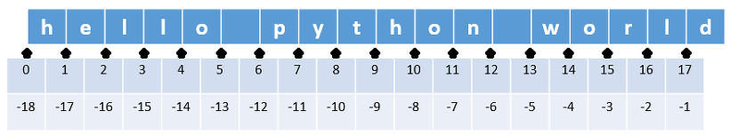

# SWEA 관련


## 1926번 문제 (369)

- 문자열의 마지막을 확인하고싶다? 혹은 하여튼 문자열의 몇번쨰 문자가 뭔지 알고싶다??

- str.strip()[확인하고싶은 위치] <<

  ```python
  a = '12345'
  print(a.strip()[-1]) --> 5가 출력됨. 
  ```


- 그냥 헛짓거리 말고 .count() 라는 스트링전용 메서드를 사용하면된다
  - .count(self, x, __start, _ _end)
  - self에 x라는 문자 혹은 문자열이 있는지 찾아줘, start~end까지 .
    - (start end는 넣지않으면 처음부터 끝까지)
  - 문자열도 * , 곱하기가 된다. (복붙가능!)


## 1979번 문제 (단어퍼즐 만들기)

- 어려워서 보류


## 2007번 문제 (단어 마디 찾기)

- 단어가 반복된다는걸 슬라이싱으로 이해해보자..
  - hellohello << 0~4번과
  -  

- 슬라이싱 번호는 이거다.. 


## 1948번 문제 (날짜 계산기)

- 딕셔너리의 키값을 불러낼땐 dic[key] << 이거임.. 대괄호임......
