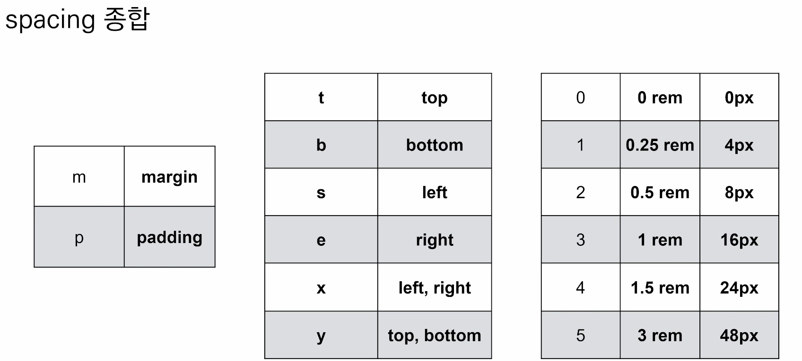

# Bootstrap

- 빠르게 반응형 사이트를 만드는 툴 키트?

- reboot.css < 얘가 부트스트랩css를 거의 카피한것


- CDN (컨텐츠 딜리버리 네트워크)
  - 컨텐츠(CSS, JS, image, text등)를 효율적으로 전달하기위해 여러노드에 가진 네트워크에 데이터를 제공하는 시스템


### spacing

```html
<div class="mt-3 ms-5">
    bootstrap-spacing
</div>
```

- mt-3 : margin top 3rem
- ms-5 : margin  


- m : property

- s,t,... : sides 

- 숫자들 : 3이 1rem이고 나머지(1~5)는 0.25~3rem

  - .mx-0 : 좌우마진이 0

  - .mx-auto : 블록요소를 수평-가운데 정렬할떄 씀 !  (인라인 x)
  - .py-0 : 패딩 탑,바텀 0

