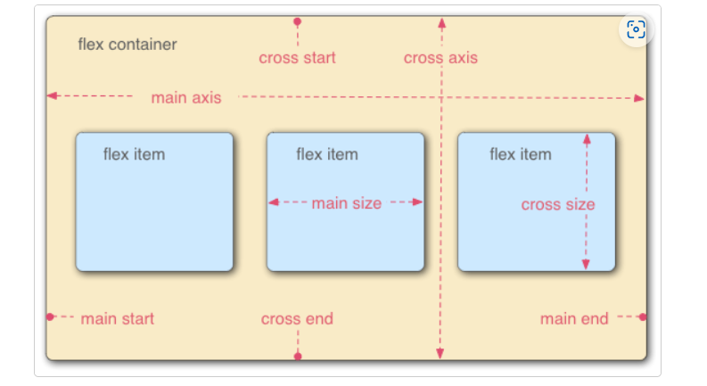

# Flexbox

- 특정 태그에 display: flex를 선언해줌으로써 플렉스모델을 만들수있음.

  

- main axis
  - flex item들이 배치되고 있는 방향으로 진행되는 축. 여기의 시작과 끝을 **main start - main end**라고 부름.
- cross axis
  - flex item들이 내부에 배치되는 방향에 직각을 이루는 축. 마찬가지로 cross start, cross end  O.

- 참고하는 파일(flexbox.html) 에서는 section 태그가 display:flex가 선언이 되어서, 
  - section 태그를 flex container로 볼 수 있음. 
  - 여기에 레이아웃되는 항목들이 flex item들임. (해당파일에선 article 태그들)

- 보면 알겠지만 flexbox가 진행되는 기본축은 row로 설정되어있음.
  - 이를 flex-direction: column; 으로 수정할 수도 있음.

- flexbox가 깨질때 (크기가 안맞아서)
  - flex-wrap: wrap; 을 해주면 된다.
    - 그러고도 애매하면 flex item 태그의 css에 flex: 200px 같은방법을 쓸 수 있다.

- flex-direction과 flex-wrap을 한번에 설정하는법이 있다.
  - flex-flow: row wrap; 이런식으로 (플로우와 랩만 합할수있다)

- flex item의 flex 크기조절방법

  - 특정 태그(아이템태그) 의 css에서,

    - flex: 1; 혹은 flex: 200px; 이런식으로 크기조절을 한다.
    - flex item이 기본 축을 따라 남은공간을 얼마나 점유할지 결정하는 CSS property다.
      - 1,2 같은건 비율이고, 200px은 최소 200픽셀을 가져간다는 의미다.
      - 그래서 flex: 1 200px; 
        - 이렇게도 된다

    - flex: 1; 이건 비율이라서, 특정 아이템에 1을주고 다른 아이템에 3을 주면 1:3의 비율로 화면을 가져가는거고
    - flex: 3;을 해도 다른 아이템에 특정 비율을 할당시키지않으면 결국 모두 동일한 비율로 화면을 차지한다.
      - 반대로 flex: 3;을 하고 다른거에 flex: 4;를 하면 3:4로 화면을 가져가고..

  - 여기서 다른 아이템을 css에서 지정할때는,

    - 특정아이템: nth-of-type(n) { flex: 2 200px; } 이런식으로 할수도 있다. (특정아이템의 n번째것은 2의 비율을 가져간다는것)

  

- flex-grow
  - flex-item 요소가 flex-container 요소 내부에서 할당 가능한 공간의 정도를 선언하는것.
    - 위에 적어둔 flex: 1; <<< 이게 flex-grow, flex-basis, flex-shrink의 단축 속성임.
      - 단축속성? - 대충 저런거임. background-color,image 따위도 background로 쓸수있음.
    - 특히 단축속성 flex에서 값이 하나일떄 -> 숫자가 입력되면 그냥 flex-grow 숫자와 동일함.
      - 길이나 퍼센트가 지정되면 flex-basis.

- flex-shrink

  - flex-item 요소 크기 비율 맞추는건데, grow랑 조금 다름.
    - 0일때 특정 flex-item이 최대크기가 되고, 1이면 모두 같은 크기, 2면 다른 요소들의 크기가 2, 특정한것은 1이 되는듯? 

  - 공식문서 피셜 좀 어려운 기능이니 나중에 다루라고 함.

**flex 속성의 정식명칭은 꼭 필요한 경우가 아니면 사용하지 말라고 권고함**

