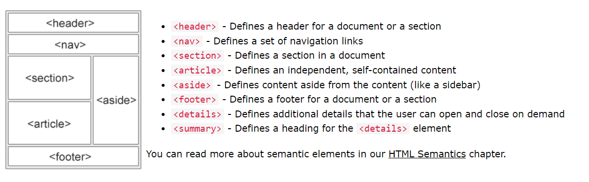

# 레이아웃(배치)

- html의 레이아웃은 다양한 시맨틱요소들을 통해 배치한다 .
  - 시맨틱요소 : 이름 그 자체로 이 태그내부가 무엇인지 의미하는것
    - 
  
  - section
    - 챕터, 소개, 뉴스 아이템, 연락 정보 등등
  - article
    - 뉴스 기사, 포럼-블로그 등의 포스트..
  - nav
    - 각종 링크들